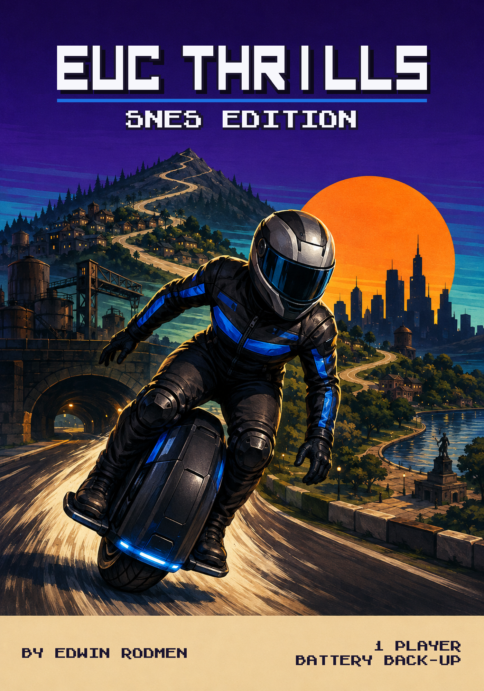
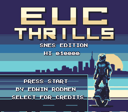
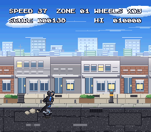
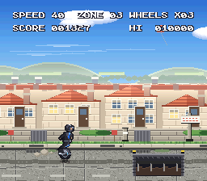

# EUC Thrills — SNES Edition

A homebrew game for the Super Nintendo Entertainment System, by
**Edwin Rodmen**.



You ride an electric unicycle down a route that runs from a city plaza out to a
forest trailhead, and the only thing you really control is your speed. Lean
forward to go faster, lean back to slow down, jump the gaps and duck the birds.
One hit ends the run. There is no brake pedal and no second chance on a hazard
— only the momentum you chose to carry into it.

|  |  |
|---|---|
|  |  |
|  |  |

## Play it

Download `euc-thrills-snes.sfc` and load it as an ordinary headerless NTSC
Super NES ROM. It is a 512 KB LoROM cartridge with battery-backed save RAM and
no enhancement chip, so anything that runs commercial SNES carts will run it.

Every button is in the manual below, but you can work the whole game out from
the title screen, which is the point.

## Controls

| Input | Action |
|---|---|
| **D-pad Right** | Lean forward — accelerate |
| **D-pad Left** | Lean back — brake |
| **B** | Jump. Distance scales with your speed. Also stands you up out of a duck |
| **Y** *or* **D-pad Down** | Duck. Held posture; clears overhead birds, and you cannot lean while low |
| **Start** | Start, pause, and return to the title from game over |
| **Select** | Credits, from the title screen only |

**Ducking never clears a gap.** The wheel has one contact patch — only being
airborne gets you over a pit. If **SPEED UP** starts blinking on the HUD, the
gap ahead is wider than your current speed can jump: accelerate before you
reach it. The game guarantees every gap is jumpable from the speed you can
reach on the run-up, and that promise holds in every round.

## A run

One round is six linked zones — **City Plaza**, **Park & Riverside**,
**Hillside**, **Industrial Edge**, **Underpass**, and **Trailhead** — each with
its own scenery, road surface and hazards. Reach the gate at the trailhead and
the next round starts.

Each round is harder than the last up to round five, after which the route
settles at a fixed difficulty, so two players' scores mean the same thing. The
minimum speed climbs, hazards sit closer together and gaps get wider.

**SCORE** counts distance, hazards cleared, zones and rounds, all multiplied by
how fast you were travelling. An extra wheel arrives at 10,000 points and every
50,000 after that, up to five. **HI** is the best run this cartridge has seen —
it lives in battery-backed SRAM, so it survives being switched off, exactly as
it would have in 1994.

## Sound

Nine sound effects, silence between them, and a theme for every zone.

There is deliberately no engine noise and no road hum. A real electric unicycle
is a nearly silent machine, so what carries the sense of speed here is a driving
arpeggio in the music rather than a noise floor underneath it. One rider theme
runs through all six zones — stated in the City Plaza, brightened in the Park,
tilted downhill at the Hillside, fractured at the Industrial Edge, stripped to
bass and echo in the Underpass, and resolved in major at the Trailhead.

On your last wheel the machine starts beeping at you, the way a real one does
when it is near its limit.

None of it is sampled from anything. Every instrument and every effect is
synthesised from arithmetic.

## Verify your download

```sh
shasum -a 256 -c SHA256SUMS.txt
```

Run it from inside this folder. Every file should report `OK`.

## What is in this package

| File | |
|---|---|
| `euc-thrills-snes.sfc` | The game. 512 KB, NTSC, LoROM |
| `euc-thrills-snes-box-front.png` | Box front artwork, 1400×2000 |
| `media/` | Screenshots, captured from this exact ROM |
| `SHA256SUMS.txt` | Checksums for everything above |
| `LICENSE` | CC BY-NC-ND 4.0, in full |
| `PERMISSIONS.md` | Extra permissions the author grants on top of it |
| `NOTICE.md` | Authorship, provenance, and non-affiliation |
| `THIRD_PARTY_NOTICES.txt` | PVSnesLib and SNESMod attribution |

There are no other builds. Anything you find elsewhere with `debug`, `test` or
`autotest` in its name is a development diagnostic and is not this game.

## Verification status

This ROM passes the project's automated gates: header and checksum, logic
tests, on-screen text decoded from video memory, all six zones, score and
battery-save behaviour, sound-bank structure, and a frame-pacing budget under
load. The exact file in this package — not a rebuild of it — boots and plays a
full run, title through game over, in both **Mesen 2.1.1** and **ares v148**.

Still open, and listed because a homebrew ROM should say so rather than let you
find out: a listening pass on the music, and acceptance on **real Super NES /
SNES Mini hardware**. One known defect: pausing on certain bars can leave a
note sustaining instead of falling silent. Reports of any of it are welcome in
the repository's issues.

## Licence

Released under
**[CC BY-NC-ND 4.0](https://creativecommons.org/licenses/by-nc-nd/4.0/)** —
keep it, play it, share the whole package for free with credit. Do not sell it,
and do not publish a modified version.

**Free does not mean unowned.** Selling this game — as a download, on a
cartridge, on a preloaded console or SD card, or inside a paid bundle — is not
permitted, and neither is putting it behind a paywall.

**Read `PERMISSIONS.md` before assuming something is banned.** Getting the ROM
onto your own console or emulator by whatever patching or repacking that takes,
sharing the package for free, and streaming or monetising *video* of the game
are all explicitly allowed.

Full terms in `LICENSE`. Authorship and provenance in `NOTICE.md` — including
which parts of this game are and are not the author's own work, stated plainly.

## Notices

An independent, unofficial homebrew project. Not affiliated with, endorsed by,
or associated with Nintendo, or with any manufacturer of electric unicycles.
"Super Nintendo Entertainment System", "Super NES" and "SNES" are Nintendo's
marks and are used only to identify the hardware this game runs on.

Built with [PVSnesLib](https://github.com/alekmaul/pvsneslib); see
`THIRD_PARTY_NOTICES.txt`.

---

**Edwin Rodmen** — [instagram.com/edwin_rodmen](https://instagram.com/edwin_rodmen)
